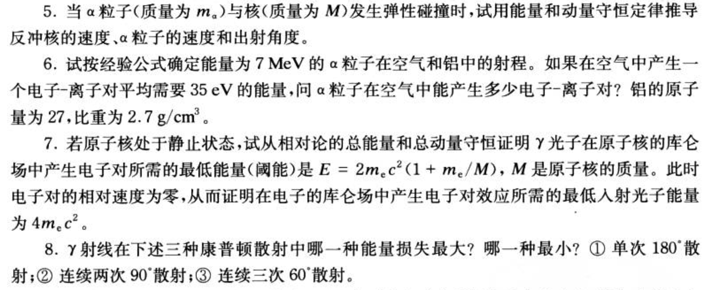
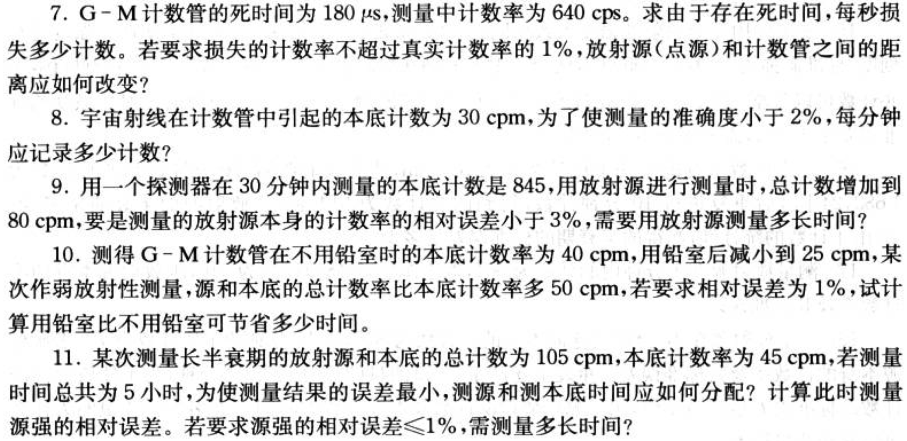

# Experimental Method in Nuclear Physics 

## 参考书
 * [Techniques for Nuclear and Particle Physics Experiments](https://link.springer.com/book/10.1007%2F978-3-642-57920-2)
 * [Radiation detection and measurement 4th edition](https://www.amazon.com/dp/0470131489/ref=rdr_ext_tmb)
 * [原子核物理实验方法 第三版](https://book.douban.com/subject/4322141)

## 通知
 * 请按照下面链接提前学习ROOT相关知识，ROOT内容将在第一章结束后开始。
## ROOT 安装
 * 安装与操作系统版本对应的virtual box虚拟机
    - 访问 [linux+ROOT virtual box镜像](https://pkuenp.quickconnect.cn/d/s/509132606843953153/gnOF_Y4_Q13MvT-ajMjsqxGZf9TPOdjf-DLtAuHr2EAc_)，下载镜像文件，密码为dataana，下载后双击导入virtualbox虚拟机即可
    - [Geant4+ROOT virtual Machine](http://geant4.in2p3.fr/spip.php?rubrique8&lang=en) 可选镜像from IN2P3，推荐！
 * 操作系统为linux，按照root.cern.ch网页的安装方法安装即可。
 
## ROOT Lecture

 * [ROOT](http://root.cern.ch)
 * [ROOT_Day1](http://hadron.physics.fsu.edu/~skpark/document/ROOT/root_beginers/ROOT_for_beginners_Day1.pdf)
 * [ROOT_Day1](http://hadron.physics.fsu.edu/~skpark/document/ROOT/root_beginers/ROOT_for_beginners_Day2.pdf)
 * [ROOT_Day1](http://hadron.physics.fsu.edu/~skpark/document/ROOT/root_beginers/ROOT_for_beginners_Day3.pdf)
 * [ROOT_Day1](http://hadron.physics.fsu.edu/~skpark/document/ROOT/root_beginers/ROOT_for_beginners_Day4.pdf)
 * [ROOT_Day1](http://hadron.physics.fsu.edu/~skpark/document/ROOT/root_beginers/ROOT_for_beginners_Day5.pdf)
 * [ROOT Primer](https://d35c7d8c.web.cern.ch/sites/d35c7d8c.web.cern.ch/files/ROOT5Primer.pdf)
    
----
## Coursework 
* 为满足不同方向的需求，提供两套作业。
    - 作业a.以模拟计算或数据处理为主，实验方向必选
    - 作业b.以计算题或推导题为主，因作业难度和完成作业时间不同，总评分比作业a 少5分。
### 作业
* 作业a要求
    - 推荐用ROOT(c++), 但也可用其他编程语言或Excel等工具.
    - 直接抄袭他人代码者记零分。
    - 提交可运行代码，分析过程与结果。
    - 经助教批改后，根据批改意见进行修改，可多次提交。成绩以最后一次提交结果评判。
    - 提交日期原则上从发布之日，两周内。可根据进度延长。
  
* 第一章
  * 做作业前先学习下面链接中的E-loss计算方法
     - 作业1.1和1.2中能量损失的计算方法 [E-loss计算方法](https://nbviewer.jupyter.org/github/pkunucexp/experimental-methods/blob/master/chapt1/elosscalc/eloss%20calculation.ipynb)
  * [1.1 计算Bragg curve](https://nbviewer.jupyter.org/github/pkunucexp/experimental-methods/blob/master/chapt1/coursework1.1/coursework%201.1%20bragg%20curve.ipynb)
  * [1.2 模拟望远镜法带电粒子鉴别](https://nbviewer.jupyter.org/github/pkunucexp/experimental-methods/blob/master/chapt1/coursework1.2/coursework%201.2%20telescope.ipynb)  
     - 作业要求中实验数据见 [望远镜法带电粒子鉴别](https://nbviewer.jupyter.org/github/pkunucexp/experimental-methods/blob/master/chapt1/telescope/telescope%20PID.ipynb)
 * 第二章
   * 2.1 参考[中心极限定理](https://nbviewer.jupyter.org/github/pkuNucExp/experimental-methods/blob/master/chapt2/centerlimit.ipynb)的做法，用指数或者朗道分布验证中心极限定理。
 * 第三章
   * 3.1-3.3 [gamma 探测器刻度作业要求及说明](https://nbviewer.jupyter.org/github/pkunucexp/experimental-methods/blob/master/chapt3/gammacal/coursework3.1/coursework%203.1%20gamma%20calibration.ipynb)
     * 数据文件[gamma.root](gamma.root)已更新！
     * 作业涉及方法原理参见[HpGe gamma 探测器刻度方法](https://nbviewer.jupyter.org/github/pkuNucExp/experimental-methods/blob/master/chapt3/gammacal/coursework3.1/3.1%20gamma%20calibration.ipynb)
     * 作业参考 [How to](https://nbviewer.jupyter.org/github/pkuNucexp/experimental-methods/blob/master/chapt3/gammacal/coursework3.1/3.1%20how%20to.ipynb)
        - 参考下面链接，学习如何用Residual plot来验证拟合结果是否合理？3.1的分析中加入Residual plot的分析。
        - [Residuals vs. Fits Plot](https://onlinecourses.science.psu.edu/stat501/node/277/)
            - [How can I tell if a model fits my data?](https://www.itl.nist.gov/div898/handbook/pmd/section4/pmd44.htm#resdef)
        - [Introduction to Optimization and Curve Fitting.mp4]() youtube video
        - [Simple Linear Regression_ Checking Assumptions with Residual Plots.mp4]() youtube video
  * 拓展作业：   
    - 现代大型核物理和粒子实验大都使用ROOT的tree结构来存储探测器的事件，基于tree的事件关联分析是数据处理的核心内容。通过完成下列作业，可掌握tree的基本用法。
    - 作业要求：
        - 将作业1.2的各探测器数据存到tree结构，按照下面链接中的数据分析示例，学习tree分析的基本用法。
        - 作业要求及参考参见使用tree储存“望远镜法”数据
### 选做作业
* 作业要求
    - 在相应章节内容讲授结束后，一周内提交。按完成度和提交时间评分。
* 粒子与物质相互作用
  - 
* 统计
  - 
* 气体探测器
  - 
* 闪烁体探测器
  - 
  
### 课程论文
- 论文内容：探测器，仪器，实验方法等
    - 与从事研究方向相关
    - 一篇实验论文或研究工作为主，讲解文章中的实验装置以及数据分析方法
- 论文：3页以上，pdf格式。包含文字，图表，参考文献
    - Phys.Rev.C latex 模板 [prc.tex](prc.tex)

- 时间
    - 确定论文题目，11月27日(周三晚10：00前)，发到助教邮箱。
    - 论文提交时间：12月13日(周五晚10：00前)，发到助教邮箱。

----
##  Lecture Notes -- PKU
- [Overview-a.pdf]()
- [chapt0 Introduction.pdf]()
- [chapt1 Interaction of Radiation with Matter.pdf]() last updated at 2 pm on Sept. 29
    - [望远镜法带电粒子鉴别](https://nbviewer.jupyter.org/github/pkunucexp/experimental-methods/blob/master/chapt1/telescope/telescope%20PID.ipynb)
    - Reference
        - [HIRA telescope.pdf]()
            - [LASSA telescope.pdf]()
        - [DALI array.pdf]()
        - [PhysRevC.65.044006_Detection of neutron clusters.pdf]()
            - [On the possible detection of 4n events in the breakup of 14Be.pdf]()
        - [PhysRevLett.116.052501.pdf]()
- [chap.2 Statistics and the Treatment of Experimental Data.pdf]()
    - [Error for Histograms.pdf]() https://www.physi.uni-heidelberg.de/~menzemer/Stat0708/statistik_vorlesung_4b.pdf
    - [随机事件事件间隔分布](https://nbviewer.jupyter.org/github/PkuNucExp/experimental-methods/blob/master/chapt2/ramdom%20timings.ipynb)
    - [各种几率分布与中心极限定理](https://nbviewer.jupyter.org/github/PkuNucExp/experimental-methods/blob/master/chapt2/centerlimit.ipynb)
    - Reference
        - [Waiting-Line Models.pdf]() applications of distribution of time intervals.
        - [JPSJ103201_Superheanvy elements Z=113.pdf]()
        - [Nature_11116_Superallowed Gamow-Teller decay.pdf]()
        - [NPA709.103.16C halo.pdf]() - example of estimating systematic error of background.
        - [The Maximum Likelihood Estimation.pdf]()
- [chap.3 General characteristics of detectors.pdf]() last updated at 8 am on Oct. 17
    - [时间常数与输出信号形状](https://nbviewer.jupyter.org/github/pkuNucexp/experimental-methods/blob/master/chapt3/time%20constant%20RC.ipynb)
    - [信号上升时间与时间分辨](https://nbviewer.jupyter.org/github/pkuNucexp/experimental-methods/blob/master/chapt3/time%20response1.ipynb)
- [chap.4 Ionization detector.pdf]() last updated at 11 pm on Oct. 25
    - References
        - [Development of Parallel Plate Avalanche Counter PPAC for BigRIPS fragment separator.pdf]()
        - [LPMWPC.pdf]()
- [chap.5 Scintillation Detector.pdf]() last updated at 4 pm on Dec. 2
    - [PMT basics and applications_CHS.pdf] Hamamatsu
- [chap.6 Semiconductor Detectors.pdf]() last updated at 7 pm on Nov. 18
- [chap.7 Electronics for Pulse Processing.pdf]() last updated at 1 pm on Dec. 7
- [chap.8 Data Acquisition Systems.pdf]() last updated at 9 am on Dec. 13
- [chap.9. Digital Pulse Processing in Nuclear physics.pdf]() last updated at 9 pm on Dec. 15

---
## Lecture Notes - UCAS
- [Overview-ucas.pdf]()
